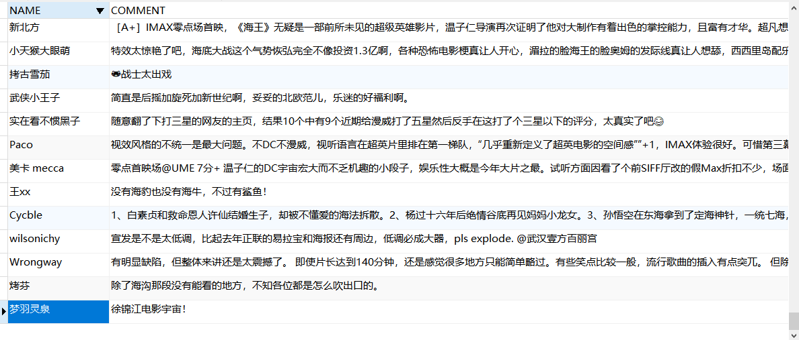
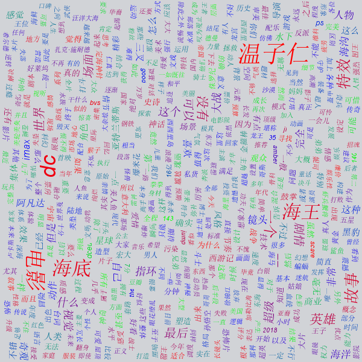

## Java使用selenium Jsoup 词云 分析海王评论信息

### 抓取有关电影海王评论使用词云进行分析
- 数据的存储
    - 使用sqlite 创建数据库 application
    - 创建表 aquaman
    ```sqlite
    CREATE TABLE aquaman(
        NAME  VARCHAR,
        COMMENT  TEXT
    )
    ```
  
  
- 主程序 Application
    - Application 程序抓取信息医用程序
    - 程序阈值为前10页的评论信息
    - 使用Jsoup对页面进行解析以及获取相关的操作信息(**Jsoup的使用后续文章教会详细介绍**此处将会替换成介绍的地址)
    - 解析之后的信息存入到db文件中（这里只获取了用户名和评论）
  
  
  ```code
    部分代码解释
    
    sqlite的connection获取
        Class.forName("org.sqlite.JDBC");
        connection = DriverManager.getConnection("jdbc:sqlite:application.db");
        
    执行创建表语句
    Statement statement = connection.createStatement();
    String createTable = "CREATE TABLE aquaman(" +
            "NAME  VARCHAR," +
            "COMMENT  TEXT" +
            ");";
    statement.execute(createTable);
    
    获取chrome的驱动
    // load the drive of chrome
    System.setProperty("webdriver.chrome.driver",
            System.getProperty("user.dir") + "/chromedriver.exe");
    ChromeDriver driver = new ChromeDriver();
    
    用户名和评论信息的获取
    String user_name = item.select("div.avatar a").attr("title").replaceAll("'", "''").replaceAll("”", "””");// user name
    String content = item.select("div.comment p span.short").html().replaceAll("'", "''").replaceAll("”", "””");// content
  ```
  
  
- 词云分析程序
    - 创建分析对象 设置相关分析参数
    - sqlite中获取已经收集好的参数信息
    - 背景或者相关样式参数的设置
    - 执行分析操作获取结果信息

```code
    部分代码分析解释
    
    创建分析对象以及参数设置
    FrequencyAnalyzer frequencyAnalyzer = new FrequencyAnalyzer();
    frequencyAnalyzer.setWordFrequenciesToReturn(600);
    frequencyAnalyzer.setMinWordLength(2);
    
    从数据集中获取采集好的数据
    String query_sql = "select comment from aquaman";
    Statement statement = connection.createStatement();
    ResultSet resultSet = statement.executeQuery(query_sql);
    List<String> commentList = new ArrayList<>();
    while (resultSet.next()) {
        commentList.add(resultSet.getObject(1).toString());
    }

```
  
    
- 效果展示
    - 采集的数据信息  
    
    - 词云效果
    


- 我有话说
    - 源码获取
        - [github](https://github.com/licunzhi/dream_on_sakura_rain/tree/master/Aquaman)
    - Java交流
        - 欢迎加群(556212318),初创欢迎大家进群折腾
