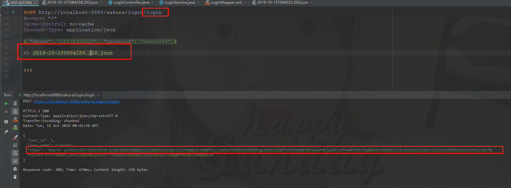

# Java如何使用token鉴权的方式实现接口认证
---

- ###JWT基础知识
我们在这里使用json web token的方式进行验证，如果对这个概念不是十分清楚的话，这里有个地址可以找一下度娘（后期如果有机会的话我会单独有文章介绍）  
针对性引入依赖
```xml
<dependency>
    <groupId>io.jsonwebtoken</groupId>
    <artifactId>jjwt</artifactId>
    <version>0.9.1</version>
</dependency>
```

- ###自定义token机制
基础数据:  有效时间，加密key，用户信息  
具体代码实现：
```java
public class JsonWebToken {

    /**
     * 有效时间
     * 秘钥
     * 前缀
     */
    private static long EXPIRATION_TIME = 30 * 60 * 1000;

    private static final String SECRET = "vue-newland-scret-key";

    private static final String HEADER_STRING = "T-Authorization";

    private static final String TOKEN_PREFIX = "Bearer";

    /**
     * 登录认证成功之后签发token
     *
     * @param jsonObject 不敏感常用信息
     * @return token结果
     */
    public static String generateToken(JSONObject jsonObject) {
        /*token只加密不敏感信息*/

        /*Claim 内置字段提供选用
         * ISSUER = "iss"       签发人
         * SUBJECT = "sub"      主题
         * AUDIENCE = "aud"     受众
         * EXPIRATION = "exp"   过期时间
         * NOT_BEFORE = "nbf"   生效时间
         * ISSUED_AT = "iat"    签发时间
         * ID = "jti"           编号
         * */

        String jwt = Jwts.builder()
                .setIssuer("AAA")
                .setSubject("BBB")
                .setAudience("CCC")
                .setExpiration(new Date(System.currentTimeMillis() + EXPIRATION_TIME))
                .setNotBefore(new Date(System.currentTimeMillis()))
                .setIssuedAt(new Date(System.currentTimeMillis()))
                .setId("DDD")
                /*
                 * 键值对   or   setPayload()
                 * */
                .addClaims(jsonObject.getInnerMap())
                .signWith(SignatureAlgorithm.HS512, SECRET).compact();
        /*简单前缀修饰   不记名token*/
        log.info("生成token数据：{}", jwt);
        return TOKEN_PREFIX + " " + jwt;
    }

    /**
     * token校验是否过期
     *
     * @param request 请求
     * @return 校验结果
     */
    public static ResponseEntity validateToken(HttpServletRequest request) {
        String token = request.getHeader(HEADER_STRING);
        if (token == null) {
            return ResponseEntity.status(HttpStatus.FORBIDDEN).body("未授权");
        }
        Claims claims;

        try {
           claims = Jwts.parser().setSigningKey(SECRET).parseClaimsJws(token.replace(TOKEN_PREFIX, "")).getBody();
        } catch (Exception e) {
            log.error("JsonWebToken validateToken error : {}", "授权码失效");
            return ResponseEntity.status(HttpStatus.FORBIDDEN).body("授权码失效");
        }
        /*可以选择no-body*/
        /*return ResponseEntity.ok().build();*/
        return ResponseEntity.ok().body(claims);
    }

}
```
备注：将生成的token数据作为返回，统一定义拦截器或者是过滤器对每次请求来的数据进行校验（上述代码中包括token码的验证操作）  

- ###拦截器
```java
public class MyInterceptor implements HandlerInterceptor {

    /**
     * token校验
     *
     * @return 是否放行
     * @throws Exception 异常
     */
    @Override
    public boolean preHandle(HttpServletRequest request, HttpServletResponse response, Object o) throws Exception {
        log.info("preHandle execute >>> {}", request.getRequestURL());
        ResponseEntity responseEntity = JsonWebToken.validateToken(request);
        if (responseEntity.getStatusCode() == HttpStatus.OK) {
            return true;
        } else {
            log.info("preHandle execute validate token fail >>> {}", request.getRequestURL());
            String path = request.getContextPath();
            response.sendRedirect(path + "/index");
            throw new NLException(HttpStatus.FORBIDDEN.value(), responseEntity.getBody().toString());
        }
//        return true;
    }

    @Override
    public void postHandle(HttpServletRequest request, HttpServletResponse response, Object o, ModelAndView modelAndView) throws Exception {
        log.info("postHandle execute >>> {}", request.getRequestURL());

    }

    @Override
    public void afterCompletion(HttpServletRequest request, HttpServletResponse response, Object o, Exception e) throws Exception {
        log.info("afterCompletion execute >>> {}", request.getRequestURL());

    }
}
```
说明：对每次请求的方法进行校验，拦截器对于生成token的方法放行。

- ###使用接口请求工具调用生成token的方法
```java
public ResponseEntity tokenLogin(Map params) {
    HashMap<String, String> login = loginMapper.login(params);
    if (login == null) {
        return ResponseEntity.badRequest().body(new ResponseBean<>(HttpStatus.BAD_REQUEST.value(), "false", "用户名或密码错误"));
    }


    /*不敏感信息封装*/
    String userProperty = "user_id,user_name";
    String[] userPropertyArr = userProperty.split(",");
    JSONObject jsonObject = new JSONObject();
    for (String name : userPropertyArr) {
        jsonObject.put(name, login.get(name));
    }

    String token = JsonWebToken.generateToken(jsonObject);
    jsonObject.put("token", token);
    return ResponseEntity.ok(jsonObject);
}
```

- ###使用idea携带工具类进行请求结果查询



---
写在后面：感谢大家的观看和收藏《一个呆萌系列》，没想到自己的创作还能被收藏，你们的鼓励是我创作动力的来源，再次感谢
