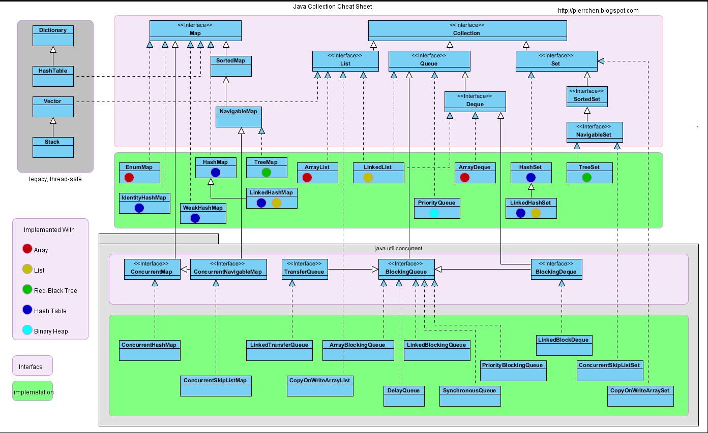

### Object 爸爸级别
- 类结构的根类，所有类的爸爸
- 构造方法
```java
    Object() 默认的无参构造器
    equals(Object obj) 判断对象是否相等
    finalize() 垃圾回收调用
    getClass() 返回运行时类
    hashCode（） 返回对象的哈希值
    notify() 唤醒正在等待对象监视器的单个线程
    notifyAll() 唤醒正在等待对象监控的所有线程
    toString() 返回对象的字符串表示形式
    wait() 导致当前线程等待，知道另一个线程调用该对象的notify()方法或者notifyAll()
    wait(long timeout) 导致当前线程等待，直到唤醒方法被调用，或者指定的时间过时
    wait(long timeout) 导致当前线程等待，直到唤醒方法被调用，或者指定的时间过时， 或某些线程中断当前线程
```
- equals()方法重写之后hashCode（）方法重写原因
    hashCode()方法获取哈希值，在哈希表中可以快速定位的数据元素所在的位置，一旦equals()方法重写之后
    判断对象是否相等规则被改写，原生的hashCode()方法获取两个不用的对象的哈希值可能不一样，导致获取存储
    混乱的情况，请注意是在哈希表中有用
- wait() notify() 结合[多线程](../1002_多线程相关问题/README.md)


### Dictionary
NOTE: This class is obsolete.  New implementations should implement the Map interface, rather than extending this class.
古老的键值存储类，推荐使用map替换

### Hashtable
Dictionary的直接子类

Java Collections Framework</a>.  Unlike the new collection
implementations, {@code Hashtable} is synchronized.  If a
thread-safe implementation is not needed, it is recommended to use
{@link HashMap} in place of {@code Hashtable}.  If a thread-safe
highly-concurrent implementation is desired, then it is recommended
to use {@link java.util.concurrent.ConcurrentHashMap} in place of
如果需要线程安全的操作推荐使用ConcurrentHashMap替换

为什么？
加锁机制是为了实现数据的读取或者是修改的安全性，hashTable使用方法枷锁的方式实现调用方法时全局枷锁，具体代码源码
```java
public synchronized V put(K key, V value) {
        // Make sure the value is not null
        if (value == null) {
            throw new NullPointerException();
        }

        // Makes sure the key is not already in the hashtable.
        Entry<?,?> tab[] = table;
        int hash = key.hashCode();
        int index = (hash & 0x7FFFFFFF) % tab.length;
        @SuppressWarnings("unchecked")
        Entry<K,V> entry = (Entry<K,V>)tab[index];
        for(; entry != null ; entry = entry.next) {
            if ((entry.hash == hash) && entry.key.equals(key)) {
                V old = entry.value;
                entry.value = value;
                return old;
            }
        }

        addEntry(hash, key, value, index);
      
```
而concurrent相当于有多个hashTable，同时可以在不同的hashTable中多个加锁操作
```java
public V get(Object key) {
        Node<K,V>[] tab; Node<K,V> e, p; int n, eh; K ek;
        int h = spread(key.hashCode());
        if ((tab = table) != null && (n = tab.length) > 0 &&
            (e = tabAt(tab, (n - 1) & h)) != null) {
            if ((eh = e.hash) == h) {
                if ((ek = e.key) == key || (ek != null && key.equals(ek)))
                    return e.val;
            }
            else if (eh < 0)
                return (p = e.find(h, key)) != null ? p.val : null;
            while ((e = e.next) != null) {
                if (e.hash == h &&
                    ((ek = e.key) == key || (ek != null && key.equals(ek))))
                    return e.val;
            }
        }
        return null;
    }
```


### Vector
- Vector是线程安全的，效率上来说应该是比ArrayList低
- Vector满了之后扩容是之前的一倍，ArrayList仅仅是一半
- Vector分配空间需要连续的存储空间，如果数据量较大的情况容易导致内存分配失败
- 只能在尾部进行插入删除操作

存储空间翻倍的原因
```java
private void grow(int minCapacity) {
        // overflow-conscious code
        int oldCapacity = elementData.length;
        // 如果设置了倍增的大小使用设置的大小，如果没有设置的话使用现有的长度加上现有的长度
        int newCapacity = oldCapacity + ((capacityIncrement > 0) ?
                                         capacityIncrement : oldCapacity);
        if (newCapacity - minCapacity < 0)
            newCapacity = minCapacity;
        if (newCapacity - MAX_ARRAY_SIZE > 0)
            newCapacity = hugeCapacity(minCapacity);
        elementData = Arrays.copyOf(elementData, newCapacity);
    }
```


### Stack - Vector子类
特点: last-in-first-out LIFO 先进后出

- 扩展了Vector与五个操作，堆栈操作 具备基本操作push peek，检测是否empty 以及search方法
- 更优化更多操作的类可以使用 **Deque** （后面探究） ，使用方式
   ```java
       Deque<Integer> stack = new ArrayDeque<Integer>();
    ``` 
- 起始版本1.0，古老的一个类
- 方法简介
```java
    Stack()                 创建一个空堆栈
    empty() boolean         判断堆栈是否为空
    peek() E                查看堆栈的顶部对象，不做删除操作
    pop() E                 获取堆栈顶部数据，删除该数据
    push(E item) E          将项目推送到次堆栈的顶部      
    search(Object o) int    返回一个对象在堆栈的位置
```
- 线程安全，内部方法采用synchronized关键字加锁
- 底层采用数组实现，通过下标的方式进行定位
- 如果不是必须保证线程安全的情况，推荐使用LinkedList


### Map interface
Map接口 传说中的地图   lindex-location
- 常见使用的接口
```
    - int size()                                返回键值对的数量 最大值为maxInteger
    - boolean isEmpty()                         是否空map
    - boolean containsKey(Object key)           key值存在性判断
    - boolean containsValue(Object value)       value值存在行判断
    - V get(Object key)                         获取key对应的属性值
    - V put(K key, V value)                     添加键值对信息，返回之前的values或者是key相关的新的values
    - void putAll(Map<? extends K, ? extends V> m)
    - V remove(Object key)                      移除key对应的values
    - void clear()                              清除键值对元素
    - Set<K> keySet()                           返回set集合
    - Collection<V> values()                    values的集合信息
    - Set<Map.Entry<K, V>> entrySet()           返回entry类型的set集合
```

### HashMap
- HashMap算是使用较频繁的Map接口实现类   
    - 提供了键值对属性的操作实现方法，k 允许为空 v 允许为空；和HashTable不同的是它允许为空并且是线程不安全的
    - 性能参数：初始化容量 DEFAULT_INITIAL_CAPACITY 负载因子 DEFAULT_LOAD_FACTOR（0.75）
        - 负载因子是容量自动增加之前允许的哈希表满足的所占度量，超出比例重排 resize()方法会变成原来的两倍
        - 原因 
            - 负载因子过高减低空间开销，但是会增大查找成本
            - 如果初始容量大于最大条目数除以负载因子，则不会发生重新排列操作
    - 线程不安全
        - 解决办法：
        <pre>
            Map m = Collections.synchronizedMap(new HashMap(...));
         </pre>
            - 实现原理（源码部分）
            ```java
                private static class SynchronizedMap<K,V>
                        implements Map<K,V>, Serializable {
                        private static final long serialVersionUID = 1978198479659022715L;
                
                        private final Map<K,V> m;     // Backing Map
                        final Object      mutex;        // Object on which to synchronize
                
                        SynchronizedMap(Map<K,V> m) {
                            this.m = Objects.requireNonNull(m);
                            mutex = this;
                        }
                
                        SynchronizedMap(Map<K,V> m, Object mutex) {
                            this.m = m;
                            this.mutex = mutex;
                        }
                
                        public int size() {
                            synchronized (mutex) {return m.size();}
                        }
                        .......
                    }
            ```
            代码中可以看出使用 final Object = mutex; 定义类锁 synchronize枷锁关键字


- 几个重要的方法源码分析
    - V put​(K key, V value)  创建关联关系
    ```code
    调用函数之前进行hash()进行hash值计算
     public V put(K key, V value) {
        return putVal(hash(key), key, value, false, true);
     }
     
     源码（闪瞎狗眼）
                          ↓
     @param onlyIfAbsent true，进行不覆盖操作
     final V putVal(int hash, K key, V value, boolean onlyIfAbsent,
                        boolean evict) {
             Node<K,V>[] tab; Node<K,V> p; int n, i;
             //空Node数组
             if ((tab = table) == null || (n = tab.length) == 0)
                 n = (tab = resize()).length;// 初始化操作，默认初始化长度16
             if ((p = tab[i = (n - 1) & hash]) == null)// 计算站位情况
                 tab[i] = newNode(hash, key, value, null);
             else {// 站位已存在
                 Node<K,V> e; K k;
                 if (p.hash == hash &&
                     ((k = p.key) == key || (key != null && key.equals(k))))// 判断hash值和当前的key一样，自己的坑
                     e = p;
                 else if (p instanceof TreeNode)// 判断是不是红黑树
                     e = ((TreeNode<K,V>)p).putTreeVal(this, tab, hash, key, value);//使用红黑树的插入方法
                 else { //链表类型
                     for (int binCount = 0; ; ++binCount) {
                         if ((e = p.next) == null) {// 下一个节点空闲
                             p.next = newNode(hash, key, value, null);// 下一个节点赋值
                             if (binCount >= TREEIFY_THRESHOLD - 1) // -1 for 1st 链表长度判断 > 7
                                 treeifyBin(tab, hash);// 转成红黑树
                             break;// >>>>>>>>>>> 循环结束
                         }
                         if (e.hash == hash &&
                             ((k = e.key) == key || (key != null && key.equals(k))))// 键存在 value值替换
                             break;
                         p = e;
                     }
                 }
                 if (e != null) { // existing mapping for key 存在hash相等相等key的节点
                     V oldValue = e.value;
                     if (!onlyIfAbsent || oldValue == null)
                         e.value = value;
                     afterNodeAccess(e);
                     return oldValue;// 返回旧值
                 }
             }
             ++modCount;// 修改次数累加一次
             if (++size > threshold)// 大于阈值进行扩容操作
                 resize();
             afterNodeInsertion(evict);
             return null;
         }
    ```
    
    解释几个源码中提到的方法
    treeifyBin(tab, hash)->转成红黑树的方法
    ```code
        final void treeifyBin(Node<K,V>[] tab, int hash) {
                int n, index; Node<K,V> e;
                if (tab == null || (n = tab.length) < MIN_TREEIFY_CAPACITY)
                    resize();
                else if ((e = tab[index = (n - 1) & hash]) != null) {
                    TreeNode<K,V> hd = null, tl = null;
                    do {
                        TreeNode<K,V> p = replacementTreeNode(e, null);
                        if (tl == null)
                            hd = p;
                        else {
                            p.prev = tl;
                            tl.next = p;
                        }
                        tl = p;
                    } while ((e = e.next) != null);
                    if ((tab[index] = hd) != null)
                        hd.treeify(tab);
                }
            }
    ```
    resize()方法 俗称扩容方法
    ```code
    final Node<K,V>[] resize() {
            Node<K,V>[] oldTab = table;
            int oldCap = (oldTab == null) ? 0 : oldTab.length;
            int oldThr = threshold;
            int newCap, newThr = 0;
            if (oldCap > 0) {// 不是空数组
                if (oldCap >= MAXIMUM_CAPACITY) {// 超出最大值不再进行扩容操作流程
                    threshold = Integer.MAX_VALUE;
                    return oldTab;// 返回之前存储的数据
                }
                else if ((newCap = oldCap << 1) < MAXIMUM_CAPACITY &&
                         oldCap >= DEFAULT_INITIAL_CAPACITY)// 介于最大容量和初始化容量之间的范围，扩容操作为原来的2倍
                    newThr = oldThr << 1; // double threshold
            }
            else if (oldThr > 0) // initial capacity was placed in threshold 容量*负载因子结果更新
                newCap = oldThr;
            else {               // zero initial threshold signifies using defaults 选用初始化的容量阈值和负载因子
                newCap = DEFAULT_INITIAL_CAPACITY;
                newThr = (int)(DEFAULT_LOAD_FACTOR * DEFAULT_INITIAL_CAPACITY);
            }
            if (newThr == 0) {// 新的阈值信息为0
                float ft = (float)newCap * loadFactor;
                newThr = (newCap < MAXIMUM_CAPACITY && ft < (float)MAXIMUM_CAPACITY ?
                          (int)ft : Integer.MAX_VALUE);
            }
            threshold = newThr;
            @SuppressWarnings({"rawtypes","unchecked"})// 下面这段代码可以解释为什么自定义初始化的Map容量或者是不合理的负载因子会导致存储的效率降低的原因
            Node<K,V>[] newTab = (Node<K,V>[])new Node[newCap];// 创建新容量大小的链表
            table = newTab;// 指向新创建大小容量的节点数组
            if (oldTab != null) {
                for (int j = 0; j < oldCap; ++j) {
                    Node<K,V> e;
                    if ((e = oldTab[j]) != null) {
                        oldTab[j] = null;
                        if (e.next == null)// 只存在一个元素直接存放
                            newTab[e.hash & (newCap - 1)] = e;// 找到赋值数组位置（取模计算定位）
                                                              //[hash值  %   数组长度]   =    [hash值   & （数组长度-1）]
                                                              //这种方法适合所有的2的N次幂计算，就算是自定义的初始化长度代码也会自动转换成近似2的N次幂
                        else if (e instanceof TreeNode)// 红黑树的处理--具体方法以后分析
                            ((TreeNode<K,V>)e).split(this, newTab, j, oldCap);
                        else { // preserve order
                            Node<K,V> loHead = null, loTail = null;// 低位首尾节点
                            Node<K,V> hiHead = null, hiTail = null;// 高位首尾节点
                            // 参照网上讲解：0-----------------------------oldCap-1----------------------newCap-1
                            //             |______________loHead_______________|_______hiTail_______________|
                            Node<K,V> next;
                            do {
                                next = e.next;
                                if ((e.hash & oldCap) == 0) {// 和老数组长度进行运算，之前的元素还是存放到之前的位置
                                    if (loTail == null)// 没有为尾节点
                                        loHead = e;
                                    else
                                        loTail.next = e;// 悬挂在尾节点
                                    loTail = e;// 设置新的尾节点
                                }
                                else {
                                    if (hiTail == null)
                                        hiHead = e;
                                    else
                                        hiTail.next = e;
                                    hiTail = e;
                                }
                            } while ((e = next) != null);
                            if (loTail != null) {// 低位元素组成的链表还是存放到之前的位置
                                loTail.next = null;
                                newTab[j] = loHead;
                            }
                            if (hiTail != null) {// 高位存放的位置是老的容量基础之上加定位
                                hiTail.next = null;
                                newTab[j + oldCap] = hiHead;
                            }
                        }
                    }
                }
            }
            return newTab;
        }
    ```

    - 面试问题
        - 重写equals()方法重写hashCode()  
            哈希表结构集合，判断数据是否存在使用equals()方法;当数据量增大的时候效率降低。  
            对每一个对象进行hash值计算存储在table中，每次去存储或者查询数据的时候判断hash  
            值是否已经存在，进而在调用equals()方法进行比较。因此如果重写了equals()方法，  
            hashcode也要重写，否则很容器出现hash值不同但是两个对象是相同的情况  
            <i>洗白了来说：hashCode方法的存在是为了减少equals（）方法调用的次数，提高效率</i>
            
        - HashMap的存储结构,工作原理  
            数组加链表: Node类型数组 Node为链表结构的对象Node([key, value, hash, next])--------[key-value|next]--->[key-value|next]
            hash值计算存储位置的信息;初始化长度16,长度可以实现自定义，底层代码会实现取初始化数据最接近的2的N次幂  
            负载因子初始化值0.75,可以自定义,没有合理的修改会导致存取的效率降低  
            超出 默认大小*负载因子的时候会自动进行扩容,实现方式通过调用resize()方法，移位操作扩展为原来的两倍  
            java8之后在链表长度超出8的时候使用红黑树结构，之前的链表结构依然存在通过使用Node的next属性维持
            
        - 定义线程安全的HashMap  
              Map<K, V> hashMap = new HashMap<>();  
              Map<K, V> map = Collections.synchronizedMap(hashMap);  
              底层使用synchronized关键字  
              无论如何使用效率没有办法和concurrentHashMap相比
                
        - HashSet之间的区别  
              实现Set接口，不允许出现重复的值 这个问题保留到Set讲解的部分问题
              
        - HashMap的使用场景  
              键值映射，键唯一 
             
        - HashMap的数据如何获取  
            通过计算hash值直接获取对应values，如果计算的时候出现hash值相同的情况，需要进而使用equals()方法再次比较  
            因此使用String Integer这种包装类作为键存储是比较好的选择，可以避免出现hash值碰撞的情况 collision detection
            
        - HashMap容量超出之后如何进行处理  
            默认的负载因子是0.75，默认容量大小是16，本质上是超出16*0.75就会出现扩容操作resize()方法，扩大为原来的两倍  
            原来的对象放在新的数组中--rehashing  
            查出阈值8会变成红黑树
            
        - HashMap大小重新调整出现的问题  
            多线程导致条件竞争,多个扩容请求,链表在多线程条件下变成循环链表死循环  
            过多的赋值旧数组到新的数据也会导致效率降低,扩容次数决定的关键因素除了默认的初始化大小问题，还有负载因子的大小  
            复制操作是一个比较耗时的操作，重新计算元素的位置
            
        - String Integer包装类为什么适合作为键  
            final 稳定不可变 重写hashCode()和equals()方法 hashCode()获取的属性值稳定性越高碰撞的概率就越小  
            你也可以自定义键值对象，但是必须满足hashCode和equals定义的方法规则
            
        - ConCurrentHashMap可以代替HashTable  
            可以，段锁segment 提高效率 但是HashTable更加安全
        
        - HashMap不安全如何体现  
            多线程put操作可能会出现覆盖操作  
            多线程扩容触发操作，循环链表死循环
