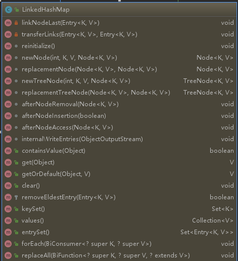

### Object 爸爸级别
- 类结构的根类，所有类的爸爸
- 构造方法
```code
    Object() 默认的无参构造器
    equals(Object obj) 判断对象是否相等
    finalize() 垃圾回收调用
    getClass() 返回运行时类
    hashCode（） 返回对象的哈希值
    notify() 唤醒正在等待对象监视器的单个线程
    notifyAll() 唤醒正在等待对象监控的所有线程
    toString() 返回对象的字符串表示形式
    wait() 导致当前线程等待，知道另一个线程调用该对象的notify()方法或者notifyAll()
    wait(long timeout) 导致当前线程等待，直到唤醒方法被调用，或者指定的时间过时
    wait(long timeout) 导致当前线程等待，直到唤醒方法被调用，或者指定的时间过时， 或某些线程中断当前线程
```
- equals()方法重写之后hashCode（）方法重写原因
    hashCode()方法获取哈希值，在哈希表中可以快速定位的数据元素所在的位置，一旦equals()方法重写之后
    判断对象是否相等规则被改写，原生的hashCode()方法获取两个不用的对象的哈希值可能不一样，导致获取存储
    混乱的情况，请注意是在哈希表中有用
- wait() notify() 结合[多线程](../1002_多线程相关问题/README.md)


### Dictionary
NOTE: This class is obsolete.  New implementations should implement the Map interface, rather than extending this class.
古老的键值存储类，推荐使用map替换

### Hashtable
Dictionary的直接子类

Java Collections Framework</a>.  Unlike the new collection
implementations, {@code Hashtable} is synchronized.  If a
thread-safe implementation is not needed, it is recommended to use
{@link HashMap} in place of {@code Hashtable}.  If a thread-safe
highly-concurrent implementation is desired, then it is recommended
to use {@link java.util.concurrent.ConcurrentHashMap} in place of
如果需要线程安全的操作推荐使用ConcurrentHashMap替换

为什么？
加锁机制是为了实现数据的读取或者是修改的安全性，hashTable使用方法枷锁的方式实现调用方法时全局枷锁，具体代码源码
```code
public synchronized V put(K key, V value) {
        // 不允许出现null值 
        if (value == null) {
            throw new NullPointerException();
        }

        Entry<?,?> tab[] = table;
        int hash = key.hashCode();
        int index = (hash & 0x7FFFFFFF) % tab.length;
        @SuppressWarnings("unchecked")
        Entry<K,V> entry = (Entry<K,V>)tab[index];// 取模运算获存储的位置信息
        for(; entry != null ; entry = entry.next) {// 如果位置占用状态，旧值覆盖并返回
            if ((entry.hash == hash) && entry.key.equals(key)) {
                V old = entry.value;
                entry.value = value;
                return old;
            }
        }

        addEntry(hash, key, value, index);// 添加新值操作
        return null;
    }
    
    
    
    
    private void addEntry(int hash, K key, V value, int index) {
            Entry<?,?> tab[] = table;
            if (count >= threshold) {
                // 超出容量rehash操作
                rehash();
    
                tab = table;
                hash = key.hashCode();
                index = (hash & 0x7FFFFFFF) % tab.length;
            }
    
            // Creates the new entry.
            @SuppressWarnings("unchecked")
            Entry<K,V> e = (Entry<K,V>) tab[index];
            tab[index] = new Entry<>(hash, key, value, e);
            count++;
            modCount++;
        }  
        
        
        
        protected void rehash() {
                int oldCapacity = table.length;
                Entry<?,?>[] oldMap = table;
        
                // 扩容操作2n+1
                int newCapacity = (oldCapacity << 1) + 1;
                if (newCapacity - MAX_ARRAY_SIZE > 0) {// 扩容长度是否超过了限制
                    if (oldCapacity == MAX_ARRAY_SIZE)
                        // Keep running with MAX_ARRAY_SIZE buckets
                        return;
                    newCapacity = MAX_ARRAY_SIZE;
                }
                Entry<?,?>[] newMap = new Entry<?,?>[newCapacity];
        
                modCount++;
                threshold = (int)Math.min(newCapacity * loadFactor, MAX_ARRAY_SIZE + 1);
                table = newMap;
        
                for (int i = oldCapacity ; i-- > 0 ;) {
                    for (Entry<K,V> old = (Entry<K,V>)oldMap[i] ; old != null ; ) {
                        Entry<K,V> e = old;
                        old = old.next;
        
                        int index = (e.hash & 0x7FFFFFFF) % newCapacity;
                        e.next = (Entry<K,V>)newMap[index];
                        newMap[index] = e;
                    }
                }
            }
```
而concurrent相当于有多个hashTable，同时可以在不同的hashTable中多个加锁操作
```code
public V get(Object key) {
        Node<K,V>[] tab; Node<K,V> e, p; int n, eh; K ek;
        int h = spread(key.hashCode());
        if ((tab = table) != null && (n = tab.length) > 0 &&
            (e = tabAt(tab, (n - 1) & h)) != null) {
            if ((eh = e.hash) == h) {
                if ((ek = e.key) == key || (ek != null && key.equals(ek)))
                    return e.val;
            }
            else if (eh < 0)
                return (p = e.find(h, key)) != null ? p.val : null;
            while ((e = e.next) != null) {
                if (e.hash == h &&
                    ((ek = e.key) == key || (ek != null && key.equals(ek))))
                    return e.val;
            }
        }
        return null;
    }
```

   - 初始化参数  
    默认大小`11` 每次扩展为原来的`2n+1`
```code
public Hashtable() {
    this(11, 0.75f);
}
```

### Vector
- Vector是线程安全的，效率上来说应该是比ArrayList低
- Vector满了之后扩容是之前的一倍，ArrayList仅仅是一半
- `Vector分配空间需要连续的存储空间，如果数据量较大的情况容易导致内存分配失败`
- 只能在尾部进行插入删除操作

存储空间翻倍的原因
```code
private void grow(int minCapacity) {
        // overflow-conscious code
        int oldCapacity = elementData.length;
        // 如果设置了倍增的大小使用设置的大小，如果没有设置的话使用现有的长度加上现有的长度
        int newCapacity = oldCapacity + ((capacityIncrement > 0) ?
                                         capacityIncrement : oldCapacity);
        if (newCapacity - minCapacity < 0)
            newCapacity = minCapacity;
        if (newCapacity - MAX_ARRAY_SIZE > 0)
            newCapacity = hugeCapacity(minCapacity);
        elementData = Arrays.copyOf(elementData, newCapacity);
    }
```


### Stack - Vector子类
特点: last-in-first-out LIFO 先进后出

- 扩展了Vector与五个操作，堆栈操作 具备基本操作push peek，检测是否empty 以及search方法
- 更优化更多操作的类可以使用 **Deque** （后面探究） ，使用方式
```code
       Deque<Integer> stack = new ArrayDeque<Integer>();
``` 
- 起始版本1.0，古老的一个类
- 方法简介
```code
    Stack()                 创建一个空堆栈
    empty() boolean         判断堆栈是否为空
    peek() E                查看堆栈的顶部对象，不做删除操作
    pop() E                 获取堆栈顶部数据，删除该数据
    push(E item) E          将项目推送到次堆栈的顶部      
    search(Object o) int    返回一个对象在堆栈的位置
```
- 线程安全，内部方法采用synchronized关键字加锁
- 底层采用数组实现，通过下标的方式进行定位
- 如果不是必须保证线程安全的情况，推荐使用LinkedList


### Map interface
Map接口 传说中的地图   index-location
- 常见使用的接口
```
    - int size()                                返回键值对的数量 最大值为maxInteger
    - boolean isEmpty()                         是否空map
    - boolean containsKey(Object key)           key值存在性判断
    - boolean containsValue(Object value)       value值存在行判断
    - V get(Object key)                         获取key对应的属性值
    - V put(K key, V value)                     添加键值对信息，返回之前的values或者是key相关的新的values
    - void putAll(Map<? extends K, ? extends V> m)
    - V remove(Object key)                      移除key对应的values
    - void clear()                              清除键值对元素
    - Set<K> keySet()                           返回set集合
    - Collection<V> values()                    values的集合信息
    - Set<Map.Entry<K, V>> entrySet()           返回entry类型的set集合
```

### HashMap
- HashMap算是使用较频繁的Map接口实现类   
    - 提供了键值对属性的操作实现方法，k 允许为空 v 允许为空；和HashTable不同的是它允许为空并且是线程不安全的
    - 性能参数：初始化容量 DEFAULT_INITIAL_CAPACITY 负载因子 DEFAULT_LOAD_FACTOR（0.75）
        - 负载因子是容量自动增加之前允许的哈希表满足的所占度量，超出比例重排 resize()方法会变成原来的两倍
        - 原因 
            - 负载因子过高减低空间开销，但是会增大查找成本
            - 如果初始容量大于最大条目数除以负载因子，则不会发生重新排列操作
    - 线程不安全
        - 解决办法：
        <pre>
            Map m = Collections.synchronizedMap(new HashMap(...));
         </pre>
            - 实现原理（源码部分）
            ```java
                private static class SynchronizedMap<K,V>
                        implements Map<K,V>, Serializable {
                        private static final long serialVersionUID = 1978198479659022715L;
                
                        private final Map<K,V> m;     // Backing Map
                        final Object      mutex;        // Object on which to synchronize
                
                        SynchronizedMap(Map<K,V> m) {
                            this.m = Objects.requireNonNull(m);
                            mutex = this;
                        }
                
                        SynchronizedMap(Map<K,V> m, Object mutex) {
                            this.m = m;
                            this.mutex = mutex;
                        }
                
                        public int size() {
                            synchronized (mutex) {return m.size();}
                        }
                        .......
                    }
            ```
            代码中可以看出使用 final Object = mutex; 定义类锁 synchronize枷锁关键字


- 几个重要的方法源码分析
    - V put​(K key, V value)  创建关联关系
    ```code
    调用函数之前进行hash()进行hash值计算
     public V put(K key, V value) {
        return putVal(hash(key), key, value, false, true);
     }
     
     源码（闪瞎狗眼）
                          ↓
     @param onlyIfAbsent true，进行不覆盖操作
     final V putVal(int hash, K key, V value, boolean onlyIfAbsent,
                        boolean evict) {
             Node<K,V>[] tab; Node<K,V> p; int n, i;
             //空Node数组
             if ((tab = table) == null || (n = tab.length) == 0)
                 n = (tab = resize()).length;// 初始化操作，默认初始化长度16
             if ((p = tab[i = (n - 1) & hash]) == null)// 计算站位情况
                 tab[i] = newNode(hash, key, value, null);
             else {// 站位已存在
                 Node<K,V> e; K k;
                 if (p.hash == hash &&
                     ((k = p.key) == key || (key != null && key.equals(k))))// 判断hash值和当前的key一样，自己的坑
                     e = p;
                 else if (p instanceof TreeNode)// 判断是不是红黑树
                     e = ((TreeNode<K,V>)p).putTreeVal(this, tab, hash, key, value);//使用红黑树的插入方法
                 else { //链表类型
                     for (int binCount = 0; ; ++binCount) {
                         if ((e = p.next) == null) {// 下一个节点空闲
                             p.next = newNode(hash, key, value, null);// 下一个节点赋值
                             if (binCount >= TREEIFY_THRESHOLD - 1) // -1 for 1st 链表长度判断 > 7
                                 treeifyBin(tab, hash);// 转成红黑树
                             break;// >>>>>>>>>>> 循环结束
                         }
                         if (e.hash == hash &&
                             ((k = e.key) == key || (key != null && key.equals(k))))// 键存在 value值替换
                             break;
                         p = e;
                     }
                 }
                 if (e != null) { // existing mapping for key 存在hash相等相等key的节点
                     V oldValue = e.value;
                     if (!onlyIfAbsent || oldValue == null)
                         e.value = value;
                     afterNodeAccess(e);
                     return oldValue;// 返回旧值
                 }
             }
             ++modCount;// 修改次数累加一次
             if (++size > threshold)// 大于阈值进行扩容操作
                 resize();
             afterNodeInsertion(evict);
             return null;
         }
    ```
    
    解释几个源码中提到的方法
    treeifyBin(tab, hash)->转成红黑树的方法
    ```code
        final void treeifyBin(Node<K,V>[] tab, int hash) {
                int n, index; Node<K,V> e;
                if (tab == null || (n = tab.length) < MIN_TREEIFY_CAPACITY)
                    resize();
                else if ((e = tab[index = (n - 1) & hash]) != null) {
                    TreeNode<K,V> hd = null, tl = null;
                    do {
                        TreeNode<K,V> p = replacementTreeNode(e, null);
                        if (tl == null)
                            hd = p;
                        else {
                            p.prev = tl;
                            tl.next = p;
                        }
                        tl = p;
                    } while ((e = e.next) != null);
                    if ((tab[index] = hd) != null)
                        hd.treeify(tab);
                }
            }
    ```
    resize()方法 俗称扩容方法
    ```code
    final Node<K,V>[] resize() {
            Node<K,V>[] oldTab = table;
            int oldCap = (oldTab == null) ? 0 : oldTab.length;
            int oldThr = threshold;
            int newCap, newThr = 0;
            if (oldCap > 0) {// 不是空数组
                if (oldCap >= MAXIMUM_CAPACITY) {// 超出最大值不再进行扩容操作流程
                    threshold = Integer.MAX_VALUE;
                    return oldTab;// 返回之前存储的数据
                }
                else if ((newCap = oldCap << 1) < MAXIMUM_CAPACITY &&
                         oldCap >= DEFAULT_INITIAL_CAPACITY)// 介于最大容量和初始化容量之间的范围，扩容操作为原来的2倍
                    newThr = oldThr << 1; // double threshold
            }
            else if (oldThr > 0) // initial capacity was placed in threshold 容量*负载因子结果更新
                newCap = oldThr;
            else {               // zero initial threshold signifies using defaults 选用初始化的容量阈值和负载因子
                newCap = DEFAULT_INITIAL_CAPACITY;
                newThr = (int)(DEFAULT_LOAD_FACTOR * DEFAULT_INITIAL_CAPACITY);
            }
            if (newThr == 0) {// 新的阈值信息为0
                float ft = (float)newCap * loadFactor;
                newThr = (newCap < MAXIMUM_CAPACITY && ft < (float)MAXIMUM_CAPACITY ?
                          (int)ft : Integer.MAX_VALUE);
            }
            threshold = newThr;
            @SuppressWarnings({"rawtypes","unchecked"})// 下面这段代码可以解释为什么自定义初始化的Map容量或者是不合理的负载因子会导致存储的效率降低的原因
            Node<K,V>[] newTab = (Node<K,V>[])new Node[newCap];// 创建新容量大小的链表
            table = newTab;// 指向新创建大小容量的节点数组
            if (oldTab != null) {
                for (int j = 0; j < oldCap; ++j) {
                    Node<K,V> e;
                    if ((e = oldTab[j]) != null) {
                        oldTab[j] = null;
                        if (e.next == null)// 只存在一个元素直接存放
                            newTab[e.hash & (newCap - 1)] = e;// 找到赋值数组位置（取模计算定位）
                                                              //[hash值  %   数组长度]   =    [hash值   & （数组长度-1）]
                                                              //这种方法适合所有的2的N次幂计算，就算是自定义的初始化长度代码也会自动转换成近似2的N次幂
                        else if (e instanceof TreeNode)// 红黑树的处理--具体方法以后分析
                            ((TreeNode<K,V>)e).split(this, newTab, j, oldCap);
                        else { // preserve order
                            Node<K,V> loHead = null, loTail = null;// 低位首尾节点
                            Node<K,V> hiHead = null, hiTail = null;// 高位首尾节点
                            // 参照网上讲解：0-----------------------------oldCap-1----------------------newCap-1
                            //             |______________loHead_______________|_______hiTail_______________|
                            Node<K,V> next;
                            do {
                                next = e.next;
                                if ((e.hash & oldCap) == 0) {// 和老数组长度进行运算，之前的元素还是存放到之前的位置
                                    if (loTail == null)// 没有为尾节点
                                        loHead = e;
                                    else
                                        loTail.next = e;// 悬挂在尾节点
                                    loTail = e;// 设置新的尾节点
                                }
                                else {
                                    if (hiTail == null)
                                        hiHead = e;
                                    else
                                        hiTail.next = e;
                                    hiTail = e;
                                }
                            } while ((e = next) != null);
                            if (loTail != null) {// 低位元素组成的链表还是存放到之前的位置
                                loTail.next = null;
                                newTab[j] = loHead;
                            }
                            if (hiTail != null) {// 高位存放的位置是老的容量基础之上加定位
                                hiTail.next = null;
                                newTab[j + oldCap] = hiHead;
                            }
                        }
                    }
                }
            }
            return newTab;
        }
    ```

    - 面试问题
        - 重写equals()方法重写hashCode()  
            哈希表结构集合，判断数据是否存在使用equals()方法;当数据量增大的时候效率降低。  
            对每一个对象进行hash值计算存储在table中，每次去存储或者查询数据的时候判断hash  
            值是否已经存在，进而在调用equals()方法进行比较。因此如果重写了equals()方法，  
            hashcode也要重写，否则很容器出现hash值不同但是两个对象是相同的情况  
            <i>洗白了来说：hashCode方法的存在是为了减少equals（）方法调用的次数，提高效率</i>
            
        - HashMap的存储结构,工作原理  
            数组加链表: Node类型数组 Node为链表结构的对象Node([key, value, hash, next])--------[key-value|next]--->[key-value|next]
            hash值计算存储位置的信息;初始化长度16,长度可以实现自定义，底层代码会实现取初始化数据最接近的2的N次幂  
            负载因子初始化值0.75,可以自定义,没有合理的修改会导致存取的效率降低  
            超出 默认大小*负载因子的时候会自动进行扩容,实现方式通过调用resize()方法，移位操作扩展为原来的两倍  
            java8之后在链表长度超出8的时候使用红黑树结构，之前的链表结构依然存在通过使用Node的next属性维持
            
        - 定义线程安全的HashMap  
              Map<K, V> hashMap = new HashMap<>();  
              Map<K, V> map = Collections.synchronizedMap(hashMap);  
              底层使用synchronized关键字  
              无论如何使用效率没有办法和concurrentHashMap相比
                
        - HashSet之间的区别  
              实现Set接口，不允许出现重复的值 这个问题保留到Set讲解的部分问题
              
        - HashMap的使用场景  
              键值映射，键唯一 
             
        - HashMap的数据如何获取  
            通过计算hash值直接获取对应values，如果计算的时候出现hash值相同的情况，需要进而使用equals()方法再次比较  
            因此使用String Integer这种`不可变对象`包装类作为键存储是比较好的选择，可以避免出现hash值碰撞的情况 collision detection
            
        - HashMap容量超出之后如何进行处理  
            默认的负载因子是0.75，默认容量大小是16，本质上是超出16*0.75就会出现扩容操作resize()方法，扩大为原来的两倍  
            原来的对象放在新的数组中--rehashing  
            超出阈值8会变成红黑树
            
        - HashMap大小重新调整出现的问题  
            多线程导致条件竞争,多个扩容请求,链表在多线程条件下变成循环链表死循环  
            过多的赋值旧数组到新的数据也会导致效率降低,扩容次数决定的关键因素除了默认的初始化大小问题，还有负载因子的大小  
            复制操作是一个比较耗时的操作，重新计算元素的位置
            
        - String Integer包装类为什么适合作为键  
            final 稳定不可变 重写hashCode()和equals()方法 hashCode()获取的属性值稳定性越高碰撞的概率就越小  
            你也可以自定义键值对象，但是必须满足hashCode和equals定义的方法规则
            
        - ConCurrentHashMap可以代替HashTable  
            可以，段锁segment 提高效率 但是HashTable更加安全
        
        - HashMap不安全如何体现  
            多线程put操作可能会出现覆盖操作  
            多线程扩容触发操作，循环链表死循环


### SortedMap interface
- SortedMap不如HashMap速度
- SortedMap存储的key类型需要实现Comparable接口,或者支持自定义排序
- 标准的构造函数：  
    1、一个void（无参数）构造函数，它创建一个根据其键的自然顺序排序的空排序映射  
    2、具有Comparator类型的单个参数的构造函数，它创建根据指定的比较器排序的空的排序映射  
    3、一个具有类型为Map的单个参数的构造函数，它创建一个与其参数具有相同键值映射的新映射，根据密钥的自然排序进行排序  
    4、一个具有类型为SortedMap的单个参数的构造函数，它创建一个具有相同键值映射和与输入排序映射相同顺序的新的排序映射。
- 方法介绍：  
    Comparator<? super K> comparator​() 默认按照主键自然排序  
    SortedMap<K,V> subMap​(K fromKey,K toKey) 关键字范围内的截取  
    SortedMap<K,V> headMap​(K toKey) 首部开始到tokey部分  
    SortedMap<K,V> tailMap​(K fromKey) 大于等于tokey到尾部部分  
    K firstKey​() 获取低位键  
    K lastKey() 高位键  
    Set<K> keySet() 返回键Set视图  
    Collection<V> values() 值集合数据  
    Set<Map.Entry<K,V>> entrySet​()
- 已知子接口
    ConcurrentNavigableMap<K, V>  
    NavigableMap<k, V>
- 已知实现类(后面立刻介绍这两个实现类)  
    TreeMap  
    ConcurrentSkipListMap  
    
    
### TreeMap
- TreeMap基于红黑树的实现，自然排序或者是构造形式的方式排序
- 非线程安全的集合（Collections.synchronizedSortedMap创建线程安全地图）
- 实现NavigableMap,提供一系列的导航方法

备注:知道非线程安全的，适用于默认排序或者是自定义排序存储


### LinkedHashMap

- 双向链表 HashMap组装成一个双向链表
- 非同步（ Map m = Collections.synchronizedMap(new LinkedHashMap(...)); ）
- LinkedHashMap能够按照插入的书序进行遍历操作
- Entry对象被修改为after before


### ConcurrentHashMap(important)
- 支持检索的完全并发性和更新的高预期并发性的哈希表。符合HashTable相同的功能规范
- 默认的并发度16
- 采用段枷锁，弱一致性，取出的数据可能是已经过时的数据  
    顺序枷锁遍历计算，然后释放，释放之后的部分可以进行插入取数据操作；因此结果获取的时候前面的一部分数据有可能已经改变了
- 初始化大小16 负载因.75 可以设置concurrencyLevel 更新并发订度


### Collection interface
- 指定的元素添加到指定的集合中addAll()
- 返回Deque作为先进先出的lifo队列视图
- sort() 按照默认的顺序进行排序 列表中的元素必须实现Comparable接口 元素必须是可以进行相互比较的  
    列表可以斯可修改的，但是不能调整大小
- reverse()列表翻转
- swap()位置切换
- fill()指定元素进行替换
- copy()对象拷贝
- 一系列的通过集合操作方法

重点问题  
sort()排序的问题  
外层的代码
```code
// 默认没有比较器的时候
public static <T extends Comparable<? super T>> void sort(List<T> list) {
    list.sort(null);------------------------------|
}                                                 |
                ----------------------------------|
                ↓
list的sort方法
@SuppressWarnings({"unchecked", "rawtypes"})
default void sort(Comparator<? super E> c) {// 从方法中参数可以看出来 传入的参数加上了泛型约束
    Object[] a = this.toArray();
    // 然后本质上还是使用了数组的sort方法
    Arrays.sort(a, (Comparator) c);----------------------------
    ListIterator<E> i = this.listIterator();                  |
    for (Object e : a) {                                      |
        i.next();                                             |
        i.set((E) e);                                         |
    }                                                         |
}                                                             |
                            -----------------------------------                            
Arrays的sort方法             ↓
public static <T> void sort(T[] a, Comparator<? super T> c) {
    if (c == null) {// 没有传入比较器的时候按照默认的方式进行比较
        sort(a);--------------------------------------------------------------------------------
    } else {                                                                                   |
        if (LegacyMergeSort.userRequested)// 使用传统的归并排序                                   |
            legacyMergeSort(a, c);                                                             |
        else// 改进之后的归并排序                                                                 |
            TimSort.sort(a, 0, a.length, c, null, 0, 0);                                       |
    }                                                                                          |
}                                                                                              |
                                               ------------------------------------------------|
                                               ↓
                                               public static void sort(Object[] a) {
                                                       if (LegacyMergeSort.userRequested)
                                                           legacyMergeSort(a);// 归并排序的方法---------------------------
                                                       else                                                            |
                                                           ComparableTimSort.sort(a, 0, a.length, null, 0, 0);         |
                                                   }                                                                   |
   --------------------------------------------------------------------------------------------------------------------
   ↓
   /** To be removed in a future release. */ //注解拷贝过来的原因，未来的版本会移除这种归并排序的方式
   private static void legacyMergeSort(Object[] a) {
       Object[] aux = a.clone();// 拷贝一份
       mergeSort(aux, a, 0, a.length, 0); ------------------------------------------
   }                                                                                |
                                        --------------------------------------------
                                        ↓
@SuppressWarnings({"unchecked", "rawtypes"})// 这是最终算法实现的代码
    private static void mergeSort(Object[] src, // 结果
                                  Object[] dest,// 操作源数据
                                  int low, //低位开始
                                  int high, //结束长度
                                  int off) {// 计算数据的次数
        int length = high - low;

        // Insertion sort on smallest arrays
        if (length < INSERTIONSORT_THRESHOLD) {// 小数组排序7 采用插入排序
            for (int i=low; i<high; i++)
                for (int j=i; j>low &&
                         ((Comparable) dest[j-1]).compareTo(dest[j])>0; j--)// 可以解释为什么是升序的原因
                    swap(dest, j, j-1);-------------------------------------------
            return;                                                                ↘ /**
                                                                                     * Swaps x[a] with x[b]. 交换两个元素之间的位置
                                                                                     */
                                                                                     private static void swap(Object[] x, int a, int b) {
                                                                                         Object t = x[a];
                                                                                         x[a] = x[b];
                                                                                         x[b] = t;
                                                                                     }
        }

        // Recursively sort halves of dest into src
        int destLow  = low;
        int destHigh = high;
        low  += off;
        high += off;
        int mid = (low + high) >>> 1;// 大路两边 分别循环调用
        mergeSort(dest, src, low, mid, -off);
        mergeSort(dest, src, mid, high, -off);

        // If list is already sorted, just copy from src to dest.  This is an
        // optimization that results in faster sorts for nearly ordered lists.
        if (((Comparable)src[mid-1]).compareTo(src[mid]) <= 0) {
            System.arraycopy(src, low, dest, destLow, length);// 完成排序数据拷贝到src中之后操作结束
            return;
        }

        // Merge sorted halves (now in src) into dest 合并排序的两部分信息
        for(int i = destLow, p = low, q = mid; i < destHigh; i++) {
            if (q >= high || p < mid && ((Comparable)src[p]).compareTo(src[q])<=0)
                dest[i] = src[p++];
            else
                dest[i] = src[q++];
        }
    }
    
    
使用传统的归并排序
TimSort.sort(a, 0, a.length, c, null, 0, 0); // 重要的思想就是分区合并

static <T> void sort(T[] a, int lo, int hi, Comparator<? super T> c,
                         T[] work, int workBase, int workLen) {
        assert c != null && a != null && lo >= 0 && lo <= hi && hi <= a.length;

        int nRemaining  = hi - lo;
        if (nRemaining < 2)// 没有数据或者是只有一个数据元素的不进行排序操作
            return;  // Arrays of size 0 and 1 are always sorted

        // If array is small, do a "mini-TimSort" with no merges// 长度限制在32以内使用mini-TimSort 使用的二分排序算法
        if (nRemaining < MIN_MERGE) {
            int initRunLen = countRunAndMakeAscending(a, lo, hi, c);//需要降序或者是升序的元素个数
            binarySort(a, lo, hi, lo + initRunLen, c);// 采用二分法
            return;
        }
        //后面的代码老子实在是玩不动了
        /**
         * March over the array once, left to right, finding natural runs,
         * extending short natural runs to minRun elements, and merging runs
         * to maintain stack invariant.
         */
        TimSort<T> ts = new TimSort<>(a, c, work, workBase, workLen);
        int minRun = minRunLength(nRemaining);
        do {
            // Identify next run
            int runLen = countRunAndMakeAscending(a, lo, hi, c);

            // If run is short, extend to min(minRun, nRemaining)
            if (runLen < minRun) {
                int force = nRemaining <= minRun ? nRemaining : minRun;
                binarySort(a, lo, lo + force, lo + runLen, c);
                runLen = force;
            }

            // Push run onto pending-run stack, and maybe merge
            ts.pushRun(lo, runLen);
            ts.mergeCollapse();

            // Advance to find next run
            lo += runLen;
            nRemaining -= runLen;
        } while (nRemaining != 0);

        // Merge all remaining runs to complete sort
        assert lo == hi;
        ts.mergeForceCollapse();
        assert ts.stackSize == 1;
    }

```


### List interface
#### 实现类
- ArrayList
- LinkedList
- Vector


### ArrayList
- 非线程安全的
- 默认大小10 private static final int DEFAULT_CAPACITY = 10;
- 可以使用Collections.synchronizedList()创建线程安全list
- 超出设置容量大小之后会扩容到之前的1.5倍 oldCapacity + (oldCapacity >> 1
- 扩容操作的本质是扩建一个更大容量的数组，将元师叔祖拷贝到新的数组中，因此扩容代价更高减少此类操作
- 采用Fail-Fast进行并发修改时会很快完全失败
- remove方法会让下标到数组末尾的元素向前移动一个单位，并把最后一位的值置空，方便GC
- ArrayList 数组形式存储 适合进行访问读取操作  LinkedList本质是链表 适合进行频繁的插入删除操作
- 不安全操作：方法使用同一个变量，后者操作参数对前者获取的信息有影响  可以使用拷贝 构建新对象 集合中的拷贝方法
- 频繁新增或者删除不适合使用 会调用System.arraycopy


### LinkedList
- 非线程安全操作
- 可以使用Collections.synchronizedList()创建线程安全的集合
- LinkedList进行查询操作的时候效率低  进行插入删除的操作时候效率比较高 链表实现 不要移动或者拷贝数组 修改链表节点的prev next
- 可以作为一个双端队列
- 不需要扩容 不需要预留空间


### Set interface
- 不包含重复元素的集合 equals

### HashSet
- 如何进行初始化操作
```code
public HashSet() {
    map = new HashMap<>();
}

还不是使用了HasHMap capacity 16 load factor 0.75


//如果创建的含有参数的初始化对象
public HashSet(Collection<? extends E> c) {
    map = new HashMap<>(Math.max((int) (c.size()/.75f) + 1, 16));
    addAll(c);
}
//源代码展示的意思就是最小的初始化大小也是16  其余的大小为创建容量0.75

//其余的初始化参数的操作方式也是采用之前的HashMap
public HashSet(int initialCapacity, float loadFactor) {
    map = new HashMap<>(initialCapacity, loadFactor);
}

public HashSet(int initialCapacity) {
    map = new HashMap<>(initialCapacity);
}

// 由于HashMap存储的时候key不允许重复的，因此可以保证存储的数据是唯一的
通过调用Map中的put操作的方法判断是否已经存在改key的value值返回此次插入操作的结果


可以理解成HashSet利用了HashMap的主键不重复的特性进行存储数据
存储数据实际上就是iHashMap的key值
```


### LinkedHashSet
- 非线程安全的
- 外部同步操作 Collections.synchronizedSet(new LinkedHashSet())


### TreeSet
- 简答来说可以参照TreeMap

### CopyOnWriteArrayList 看不懂没关系  纯属意淫
- 难得一见线程安全
- ReentrantLock lock方式枷锁操作 final修饰
- 添加元素的反复拷贝是他的缺点
- 数组形式的存储形式
    - 因此重点在 ReentrantLock的lock方法  
      介绍：CopyOnWrite 简称COW 程序设计中的优化策略 存储数据内容开始被大家共享，如果出现被修改的情况会把这块内容拷贝出去然后在进行修改  
      这种思想是读写分离思想 拷贝数去的数据添加操作结束之后  将旧的地址指向新的地址 所以操作不需要安全枷锁操作
      目前实现这种方式的有： CopyOnWriteArrayList and CopyOnWriteSet  
      不需要不代表没有  add操作中就进行了枷锁的操作  不过似乎是可重入锁
      ```code
      // 代码注解解释的是  添加元素到List的结尾处  不进行枷锁操作的话会导致新增数据元素的时候出现多个被复制数组
        public boolean add(E e) {
            final ReentrantLock lock = this.lock;
            lock.lock();
            try {
                Object[] elements = getArray();
                int len = elements.length;
                Object[] newElements = Arrays.copyOf(elements, len + 1);
                newElements[len] = e;
                setArray(newElements);
                return true;
            } finally {
                lock.unlock();
            }
        }
      ```
      
      - 醉翁之意不在酒   在ReentrantLock可重入锁的使用 (好像有点难  先放着了 以后杀个回马枪)
