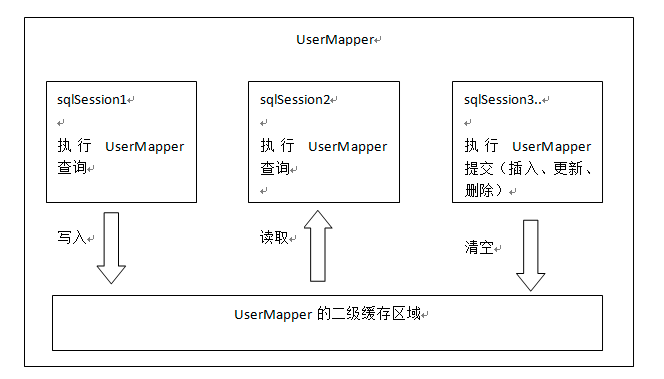

## Mybatis相关问题

### 缓存级别

- 一级缓存
   - 
   - 
   - 缓存的生命周期  
   一级缓存在进行select查询的时候cache中存放查询记录的结果信息  
   session的close会导致cache中的结果失效  
   session调用clearCache方法导致cache失效 
   - 缓存是如何判断什么时候去里面查询数据信息的  
   statementID 查询参数  查询语句 查询范围 
 所有的更新数据的操作将导致cache失效
- 二级缓存
    - 为什么存在二级缓存  
    缓存的作用确实节省了查询时间 节省资源，但是每次update的操作导致以及缓存生命周期失效不免还是有点缺陷 因此在此基础之上出现了二级缓存
    - 二级缓存共享图  
    
    - 缓存查询机制  
    不同的sqlsession进行查询的时候 可以判断缓存中是否存在该数据  如果存在直接在缓存中获取而不用再次去查询
    - 范围更大  
    区别一级缓存针对的单独的sqlSession 二级缓存可以多个session共享一个mapper缓存信息


### Mybatis的运行原理  核心技术

> 解释参照https://blog.csdn.net/luanlouis/article/details/40422941 个人总结使用  故在这里注明

- 组件构成
    - `sqlSession` 负责会话管理
    - `Executor` 执行器
    - `StatementHandler` 分装jdbcTemplate
    - `ParameterHandler` 封装jdbcTemplate操作
    - `ResultSetHandler` 返回结果处理
    - `TypeHandler` java数据类型和数据库中的数据类型之间的转换
    - `MappedStatement` 维护增删改查节点封装
    - `sqlSource` 动态生成sql语句到BoundSql对象中
    - `BoundSql` 标识动态生成的sql语句以及相应的参数信息
    - `Configuration` Mybatis中所有的配置信息都在其中
    
- query
```code
BaseExecutor.java
@Override
  public <E> List<E> query(MappedStatement ms, Object parameter, RowBounds rowBounds, ResultHandler resultHandler) throws SQLException {
    // 方法获取BoundSql 
    BoundSql boundSql = ms.getBoundSql(parameter);
                                        |||// 断点设置位置
                        public BoundSql getBoundSql(Object parameterObject) {
                            BoundSql boundSql = sqlSource.getBoundSql(parameterObject);
                                            |||// 断点设置位置
                                            public BoundSql getBoundSql(Object parameterObject) {
                                                SqlSource sqlSource = createSqlSource(parameterObject);
                                                return sqlSource.getBoundSql(parameterObject);
                                              }
                            List<ParameterMapping> parameterMappings = boundSql.getParameterMappings();
                            if (parameterMappings == null || parameterMappings.isEmpty()) {
                              boundSql = new BoundSql(configuration, boundSql.getSql(), parameterMap.getParameterMappings(), parameterObject);
                            }
                        
                            // check for nested result maps in parameter mappings (issue #30)
                            for (ParameterMapping pm : boundSql.getParameterMappings()) {
                              String rmId = pm.getResultMapId();
                              if (rmId != null) {
                                ResultMap rm = configuration.getResultMap(rmId);
                                if (rm != null) {
                                  hasNestedResultMaps |= rm.hasNestedResultMaps();
                                }
                              }
                            }
                        
                            return boundSql;
                          }
    //创建缓存key 有二级缓存
    CacheKey key = createCacheKey(ms, parameter, rowBounds, boundSql);
                                   |||
                                   public CacheKey createCacheKey(MappedStatement ms, Object parameterObject, RowBounds rowBounds, BoundSql boundSql) {
                                       if (closed) {
                                         throw new ExecutorException("Executor was closed.");
                                       }
                                       // 创建缓存key 设置相关属性信息 msid + offset + limit + sql
                                       CacheKey cacheKey = new CacheKey();
                                       cacheKey.update(ms.getId());
                                       cacheKey.update(rowBounds.getOffset());
                                       cacheKey.update(rowBounds.getLimit());
                                       cacheKey.update(boundSql.getSql());
                                       List<ParameterMapping> parameterMappings = boundSql.getParameterMappings();
                                       TypeHandlerRegistry typeHandlerRegistry = ms.getConfiguration().getTypeHandlerRegistry();
                                       // mimic DefaultParameterHandler logic
                                       for (ParameterMapping parameterMapping : parameterMappings) {
                                         if (parameterMapping.getMode() != ParameterMode.OUT) {
                                           Object value;
                                           String propertyName = parameterMapping.getProperty();
                                           if (boundSql.hasAdditionalParameter(propertyName)) {
                                             value = boundSql.getAdditionalParameter(propertyName);
                                           } else if (parameterObject == null) {
                                             value = null;
                                           } else if (typeHandlerRegistry.hasTypeHandler(parameterObject.getClass())) {
                                             value = parameterObject;
                                           } else {
                                             MetaObject metaObject = configuration.newMetaObject(parameterObject);
                                             value = metaObject.getValue(propertyName);
                                           }
                                           cacheKey.update(value);
                                         }
                                       }
                                       if (configuration.getEnvironment() != null) {
                                         // issue #176
                                         cacheKey.update(configuration.getEnvironment().getId());
                                       }
                                       return cacheKey;
                                     }
    return query(ms, parameter, rowBounds, resultHandler, key, boundSql);
 }
```
