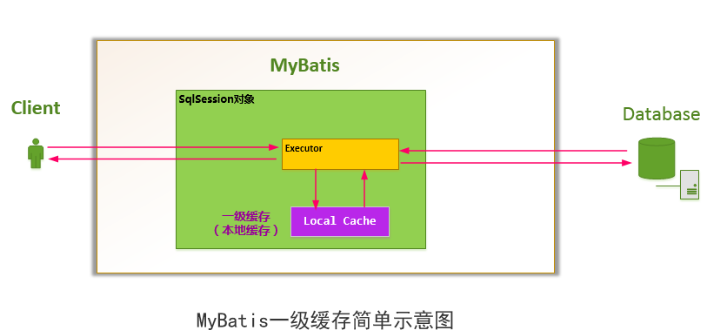
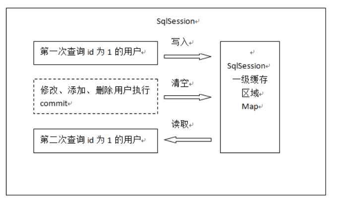

### 缓存级别

- 一级缓存
   - 
   - 
   - 缓存的生命周期  
   一级缓存在进行select查询的时候cache中存放查询记录的结果信息  
   session的close会导致cache中的结果失效  
   session调用clearCache方法导致cache失效  
 所有的更新数据的操作将导致cache失效
- 二级缓存
    - 为什么存在二级缓存  
    缓存的作用确实节省了查询时间 节省资源，但是每次update的操作导致以及缓存生命周期失效不免还是有点缺陷 因此在此基础之上出现了二级缓存
    
